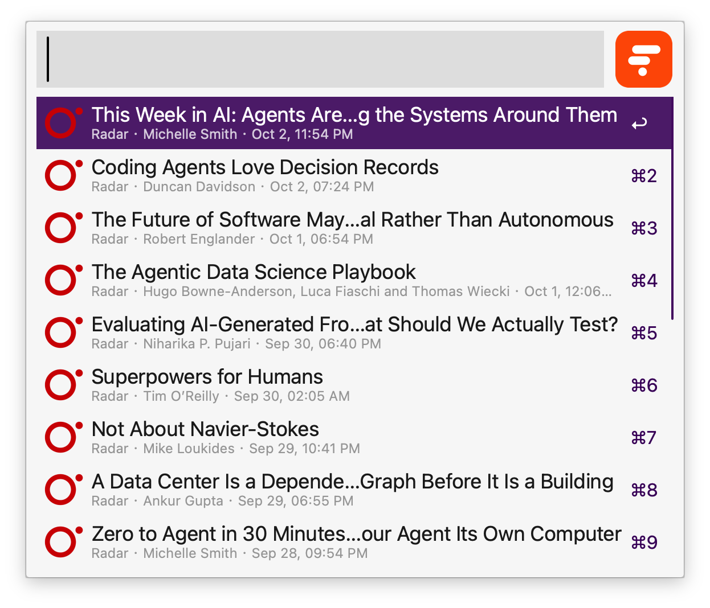

## Setup

Run the `folologin` keyword and complete sign-in in your browser. The workflow saves your Folo token in the Workflow’s Configuration.

Alternatively, run this command in Terminal to get a token manually:

```sh
npx --yes folocli@latest login
```

After signing in, open the `configPath` shown in the command output. Copy its `token` value into **Folo Auth Token** in the Workflow’s Configuration.

## Usage

Browse unread Folo entries via the `ftl` keyword.



- <kbd>↩</kbd> Open the article and mark it as read.
- <kbd>⌃</kbd><kbd>↩</kbd> Open the entry in Folo.
- <kbd>⌥</kbd><kbd>↩</kbd> Show the next page of entries.
- <kbd>⇧</kbd><kbd>⌥</kbd><kbd>↩</kbd> Return to the first page.
- <kbd>⌘</kbd><kbd>↩</kbd> Mark all entries in the current timeline as read.

Use <kbd>⌥</kbd><kbd>↩</kbd> on the `ftl` keyword to include entries you have already read. Use <kbd>⌘</kbd><kbd>↩</kbd> on the keyword to reopen your last timeline view.

Find subscriptions with unread entries via the `fun` keyword. Select a feed or list to browse its unread entries.

- <kbd>↩</kbd> Browse unread entries in the selected feed or list.
- <kbd>⌥</kbd><kbd>↩</kbd> Include entries you have already read.
- <kbd>⌘</kbd><kbd>↩</kbd> Mark all entries in the selected feed or list as read.

Search your followed feeds and lists via the `fsub` keyword.

- <kbd>↩</kbd> Browse entries in the selected feed or list.
- <kbd>⌥</kbd><kbd>↩</kbd> Show only unread entries.

Change the three keywords and the number of timeline results in the Workflow’s Configuration.
