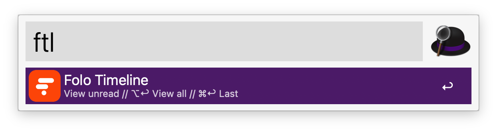
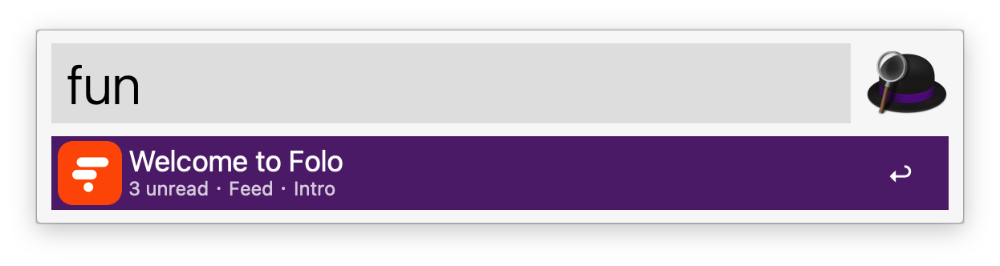
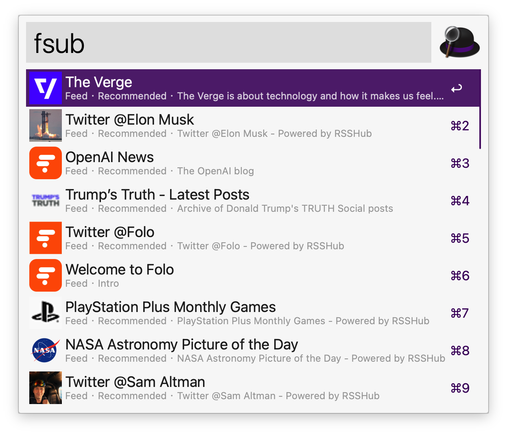

# Folo RSS Reader

Read your [Folo](https://folo.is) timeline entries with Alfred.

## Setup

Run the `folologin` keyword and complete sign-in in your browser. The workflow saves your Folo token in the Workflow's Configuration.

Alternatively, see _Appendix 1_ for manual token retrieval.

## Usage

Browse timeline via the `ftl` keyword.



- <kbd>↩</kbd> Open the unread timeline.
- <kbd>⌥</kbd><kbd>↩</kbd> Open the all timeline.
- <kbd>⌘</kbd><kbd>↩</kbd> Reopen the last read page.


- <kbd>↩</kbd> Open the entry.
- <kbd>⌥</kbd><kbd>↩</kbd> Show the next page of entries.
- <kbd>⇧</kbd><kbd>⌥</kbd><kbd>↩</kbd> Return to the first page.
- <kbd>⌘</kbd><kbd>↩</kbd> Mark all entries in the current timeline as read.
- <kbd>⌃</kbd><kbd>↩</kbd> Open the entry in Folo.

Find subscriptions with unread entries via the `fun` keyword.



- <kbd>↩</kbd> Browse unread entries in the selected subscription.
- <kbd>⌥</kbd><kbd>↩</kbd> Include entries you have already read.
- <kbd>⌘</kbd><kbd>↩</kbd> Mark all entries in the selected subscription as read.

Search your followed feeds and lists via the `fsub` keyword.



- <kbd>↩</kbd> Browse entries in the selected subscription.
- <kbd>⌥</kbd><kbd>↩</kbd> Show only unread entries.

## References

[GitHub Repo](https://github.com/fradeet/alfred-folo-workflow)

## Appendix 1: Manual Folo Token Retrieval

Alternatively, run this command in Terminal to get a token manually:

```sh
npx --yes folocli@0.0.5 login
```

After signing in, open the `configPath` shown in the command output. Copy its `token` value into **Folo Auth Token** in the Workflow’s Configuration.
